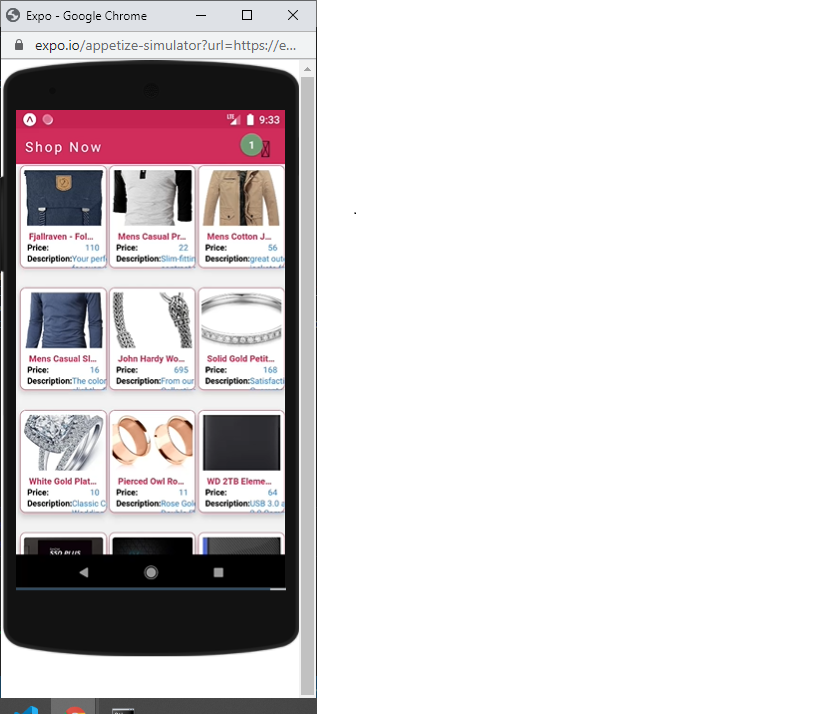

# React-Native small app
## Created by Krutik Parikh in Expo Cli
### Technologies used
- React-Native(Hooks)
- Axios
- React-Navigation
- Redux

Currently there is issue going on with expo icon which Shows ? instead of icons for full problem Visit Site [Bug](https://forums.expo.io/t/question-mark-instead-of-the-ionicons-icon/46864). 

Run on Your own Device
```
Clone repo
yarn install
yann android
```

Run on Expo Client
```
Clone repo
yarn install
Install Expo client from Play store or App store
Android - Scan QR code from Expo Client
Ios -  Scan QR code from Phone Camera
```
Run on Web Browser
Visit Site [Expo](https://expo.io/@parikrut/projects/hangrytestkp).
```
Open in browser
once the phone launch in browser
scroll down and click open project using brower
```

### Sample Image


